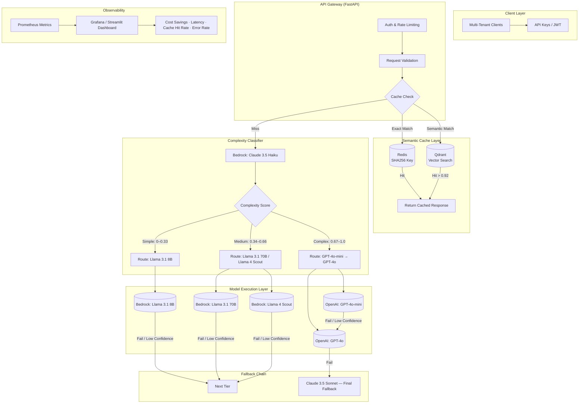

# LLM Gateway — Multi-LLM Routing & Cost-Optimization

[](https://python.org)
[](https://fastapi.tiangolo.com)
[](https://aws.amazon.com/bedrock/)
[](LICENSE)
[](CONTRIBUTING.md)

An intelligent gateway that routes every LLM request to the optimal model based on prompt complexity — combining AWS Bedrock and OpenAI behind one OpenAI-compatible API, with dual-layer semantic caching, automatic fallback, and per-tenant cost attribution.

Built and maintained by [LeopardCode.AI](https://leopardcode.ai).

---

## The Problem

Enterprises adopting LLMs face three recurring challenges:

| Challenge | Impact |
|-----------|--------|
| **Uncontrolled costs** | Routing everything to GPT-4o at $5/1M tokens scales to $50K+/month |
| **Vendor lock-in** | Single-provider dependency with no fallback path |
| **Latency variance** | No routing optimization matched to task complexity |

## The Solution

The gateway classifies each prompt's complexity with a fast, inexpensive model (Claude 3.5 Haiku) and routes it to the cheapest model that can handle it — Llama 3.1 8B for simple tasks up to GPT-4o for complex reasoning. Exact and semantic caching short-circuit repeated requests entirely.

```
Before: every prompt → GPT-4o            After: complexity-tiered routing
        $5.00 / 1M tokens                       $0.12–$2.50 / 1M tokens
        single vendor                           multi-provider + fallback chain
```

---

## Architecture



---

## Key Features

| Feature | Description | Technology |
|---------|-------------|------------|
| **LLM-based classification** | Claude 3.5 Haiku scores prompt complexity | AWS Bedrock |
| **Tiered routing** | Simple → Llama 8B, Medium → Llama 70B/Scout, Complex → GPT-4o | Custom router |
| **Dual-layer cache** | Redis (exact match) + Qdrant (semantic, cosine > 0.92) | Redis + Qdrant |
| **Automatic fallback** | Failure or low confidence escalates to the next tier | Resilience patterns |
| **Multi-tenancy** | API keys, per-tenant quotas, model allowlists | DynamoDB + FastAPI |
| **Real-time dashboard** | Cost savings, latency, cache hits, error rates | Streamlit / Grafana |
| **Cost attribution** | Per-tenant, per-model, per-request tracking | Prometheus + DynamoDB |
| **Zero secrets in code** | All credentials via AWS Secrets Manager / IAM roles | AWS best practices |

## Design Targets

| Metric | Target |
|--------|--------|
| Cost reduction | 40–60% vs. a GPT-4o-only baseline |
| Cache hit rate | 25–40% (exact + semantic) |
| P99 latency overhead | < 50 ms |
| Fallback success rate | > 99.9% |
| Classification accuracy | > 92% on benchmark |

---

## Quick Start

### Prerequisites

- Python 3.11+
- AWS account with Bedrock access (Claude Haiku, Llama models)
- OpenAI API key
- Redis & Qdrant (local or managed)
- Docker (optional)

### Installation

```bash
git clone https://github.com/leopardcodeai/aws-multi-llm-gateway-cost-analysis.git
cd aws-multi-llm-gateway-cost-analysis

python -m venv .venv
source .venv/bin/activate
pip install -r requirements.txt

cp .env.example .env   # then add your credentials
```

### Configuration

```yaml
# config.yaml
gateway:
  host: "0.0.0.0"
  port: 8000
  workers: 4

classifier:
  model: "anthropic.claude-3-5-haiku-20241022-v1:0"
  region: "us-east-1"
  confidence_threshold: 0.7

router:
  tiers:
    simple:
      primary: "meta.llama3-1-8b-instruct-v1:0"
      fallback: "meta.llama3-8b-instruct-v1:0"
    medium:
      primary: "meta.llama3-1-70b-instruct-v1:0"
      fallback: "meta.llama4-scout-17b-instruct-v1:0"
    complex:
      primary: "gpt-4o-mini"
      fallback: "gpt-4o"
      final_fallback: "anthropic.claude-3-5-sonnet-20241022-v2:0"

cache:
  redis:
    host: "localhost"
    port: 6379
    ttl: 86400
  qdrant:
    host: "localhost"
    port: 6333
    collection: "semantic_cache"
    similarity_threshold: 0.92

auth:
  dynamodb_table: "llm-gateway-tenants"
  default_quota: 100000  # tokens/month
```

### Run Locally

```bash
# Start dependencies
docker-compose up -d redis qdrant

# Run the gateway
uvicorn src.gateway.main:app --reload --host 0.0.0.0 --port 8000

# Run the dashboard (separate terminal)
streamlit run src/observability/dashboard.py
```

### Test the Gateway

```bash
# Simple classification task → routes to Llama 8B
curl -X POST http://localhost:8000/v1/chat/completions \
  -H "Authorization: Bearer llmgw_your_api_key" \
  -H "Content-Type: application/json" \
  -d '{
    "model": "auto",
    "messages": [{"role": "user", "content": "Classify this sentiment: I love this product!"}],
    "temperature": 0
  }'

# Complex reasoning → routes to GPT-4o
curl -X POST http://localhost:8000/v1/chat/completions \
  -H "Authorization: Bearer llmgw_your_api_key" \
  -H "Content-Type: application/json" \
  -d '{
    "model": "auto",
    "messages": [{"role": "user", "content": "Design a distributed system for real-time analytics..."}],
    "temperature": 0.3
  }'
```

---

## Project Structure

```
.
├── src/
│   ├── gateway/          # FastAPI app, routes, middleware
│   ├── classifier/       # Complexity classification (Bedrock)
│   ├── router/           # Model routing logic + fallback
│   ├── cache/            # Redis + Qdrant cache layer
│   ├── auth/             # Multi-tenant auth, quotas
│   ├── observability/    # Metrics, dashboard, logging
│   └── models/           # Pydantic schemas, model configs
├── tests/                # Unit + integration tests
├── infra/                # Terraform for AWS resources
├── diagrams/             # Architecture diagrams (Excalidraw, Mermaid)
├── docs/                 # Documentation
├── docker-compose.yml    # Local dev stack
├── requirements.txt
├── config.yaml
└── .env.example
```

---

## Infrastructure (Terraform)

Key AWS resources are provisioned via Terraform: a Bedrock invocation role, a pay-per-request DynamoDB table for tenants, an OpenAI API key in Secrets Manager, and an ElastiCache Redis replication group.

```bash
cd infra
terraform init
terraform plan
terraform apply
```

---

## Testing

```bash
# Unit tests
pytest tests/unit -v

# Integration tests (requires AWS credentials)
pytest tests/integration -v

# Load test
locust -f tests/load/locustfile.py --host=http://localhost:8000
```

---

## Security

- **Zero credentials in code** — all secrets via AWS Secrets Manager / IAM roles
- **API keys** — prefixed (`llmgw_`), hashed in DynamoDB, rotatable
- **Rate limiting** — per tenant and per model, configurable
- **Audit logging** — all requests/responses to S3 (encrypted)
- **Network** — VPC endpoints for Bedrock; no public internet path to models

---

## Contributing

1. Fork the repository
2. Create a feature branch: `git checkout -b feat/amazing-feature`
3. Commit your changes: `git commit -m 'feat: add amazing feature'`
4. Push: `git push origin feat/amazing-feature`
5. Open a pull request

See [CONTRIBUTING.md](CONTRIBUTING.md) for details.

## License

MIT — see [LICENSE](LICENSE).

---

<p align="center">
  <sub>Built by <a href="https://leopardcode.ai">LeopardCode.AI</a> — AI Engineering &amp; Consulting</sub>
</p>
